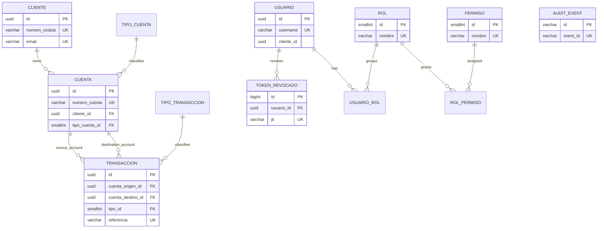
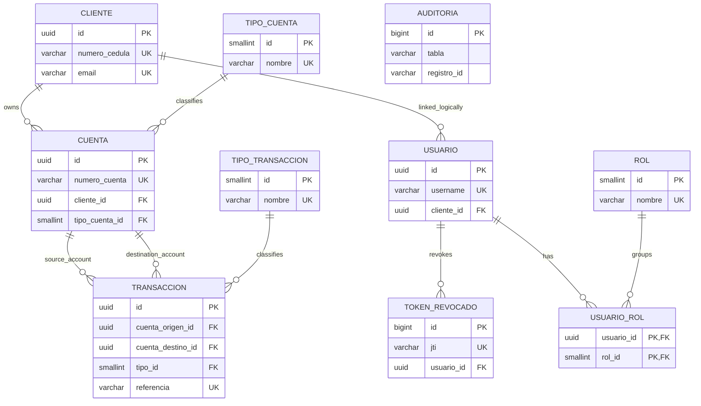
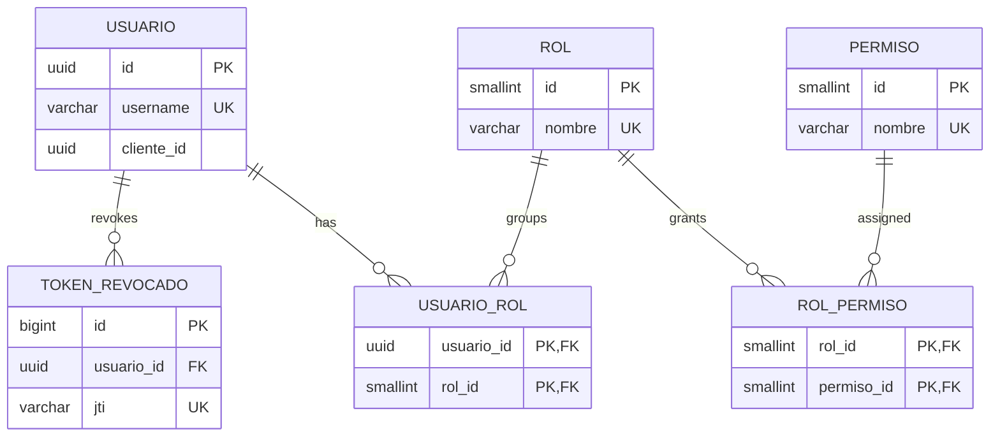
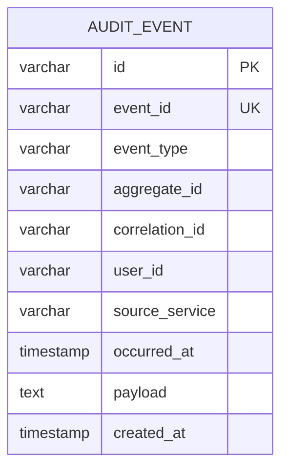
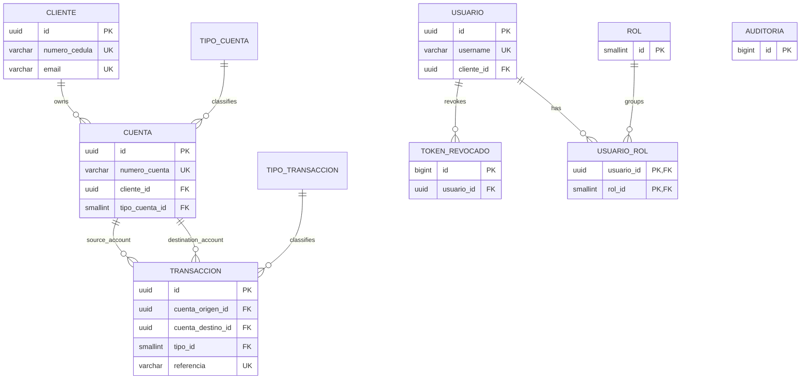

# All Databases Model

This document consolidates the ER model and the physical model of the four service databases defined in this repository:

- `banco_digital_core`
- `banco_digital_identity`
- `banco_digital_audit`
- `banco_digital_reporting`

## 1. Global ER Model

## 2. Cross-Database View

The design is primarily `database per service`, but there are two important cross-database facts:

- `identity` stores `usuario.cliente_id` as a business reference to a client from `core`, but there is no physical foreign key across databases.
- `reporting` owns `banco_digital_reporting`, but also connects to `banco_digital_core` as a secondary datasource for migration/bootstrap reads.

## 3. Database: banco_digital_core

### 3.1 ER Model

### 3.2 Physical Model

#### `cliente`

| Column | Type | Null | Key | Notes |
|---|---|---:|---|---|
| `id` | `UUID` | No | PK | default `gen_random_uuid()` |
| `numero_cedula` | `VARCHAR(20)` | No | UK | immutable by API comment |
| `primer_nombre` | `VARCHAR(100)` | No |  |  |
| `segundo_nombre` | `VARCHAR(100)` | Yes |  |  |
| `primer_apellido` | `VARCHAR(100)` | No |  |  |
| `segundo_apellido` | `VARCHAR(100)` | Yes |  |  |
| `email` | `VARCHAR(255)` | No | UK |  |
| `telefono` | `VARCHAR(20)` | Yes |  |  |
| `fecha_nacimiento` | `DATE` | No |  |  |
| `activo` | `BOOLEAN` | No |  | default `TRUE` |
| `created_at` | `TIMESTAMPTZ` | No |  | default `NOW()` |
| `updated_at` | `TIMESTAMPTZ` | No |  | default `NOW()` |
| `created_by` | `VARCHAR(100)` | No |  | default `SYSTEM` |
| `updated_by` | `VARCHAR(100)` | No |  | default `SYSTEM` |

Indexes:

- `idx_cliente_email`
- `idx_cliente_cedula`
- `idx_cliente_activo` partial on active clients

#### `tipo_cuenta`

| Column | Type | Null | Key | Notes |
|---|---|---:|---|---|
| `id` | `SMALLINT` | No | PK | seeded values |
| `nombre` | `VARCHAR(50)` | No | UK | `AHORRO`, `CORRIENTE` |
| `descripcion` | `VARCHAR(200)` | Yes |  |  |

#### `cuenta`

| Column | Type | Null | Key | Notes |
|---|---|---:|---|---|
| `id` | `UUID` | No | PK | default `gen_random_uuid()` |
| `numero_cuenta` | `VARCHAR(20)` | No | UK |  |
| `cliente_id` | `UUID` | No | FK | `cliente(id)` |
| `tipo_cuenta_id` | `SMALLINT` | No | FK | `tipo_cuenta(id)` |
| `saldo` | `NUMERIC(18,2)` | No |  | default `0.00`, check `saldo >= 0` |
| `estado` | `VARCHAR(20)` | No |  | `ACTIVA`, `INACTIVA`, `BLOQUEADA` |
| `fecha_apertura` | `DATE` | No |  | default `CURRENT_DATE` |
| `created_at` | `TIMESTAMPTZ` | No |  | default `NOW()` |
| `updated_at` | `TIMESTAMPTZ` | No |  | default `NOW()` |
| `created_by` | `VARCHAR(100)` | No |  | default `SYSTEM` |
| `updated_by` | `VARCHAR(100)` | No |  | default `SYSTEM` |

Indexes:

- `idx_cuenta_cliente_id`
- `idx_cuenta_estado`
- `idx_cuenta_numero`

#### `tipo_transaccion`

| Column | Type | Null | Key | Notes |
|---|---|---:|---|---|
| `id` | `SMALLINT` | No | PK | seeded values |
| `nombre` | `VARCHAR(50)` | No | UK | `DEPOSITO`, `RETIRO`, `TRANSFERENCIA_DEBITO`, `TRANSFERENCIA_CREDITO` |

#### `transaccion`

| Column | Type | Null | Key | Notes |
|---|---|---:|---|---|
| `id` | `UUID` | No | PK | default `gen_random_uuid()` |
| `cuenta_origen_id` | `UUID` | Yes | FK | `cuenta(id)` |
| `cuenta_destino_id` | `UUID` | Yes | FK | `cuenta(id)` |
| `tipo_id` | `SMALLINT` | No | FK | `tipo_transaccion(id)` |
| `monto` | `NUMERIC(18,2)` | No |  | check `monto > 0` |
| `saldo_anterior` | `NUMERIC(18,2)` | No |  |  |
| `saldo_posterior` | `NUMERIC(18,2)` | No |  |  |
| `descripcion` | `VARCHAR(255)` | Yes |  |  |
| `referencia` | `VARCHAR(50)` | Yes | UK |  |
| `estado` | `VARCHAR(20)` | No |  | `COMPLETADA`, `FALLIDA`, `REVERTIDA` |
| `created_at` | `TIMESTAMPTZ` | No |  | default `NOW()` |
| `created_by` | `VARCHAR(100)` | No |  | default `SYSTEM` |

Indexes:

- `idx_trans_cuenta_origen`
- `idx_trans_cuenta_destino`
- `idx_trans_created_at`
- `idx_trans_tipo`

#### `auditoria`

| Column | Type | Null | Key | Notes |
|---|---|---:|---|---|
| `id` | `BIGSERIAL` | No | PK |  |
| `tabla` | `VARCHAR(50)` | No |  |  |
| `operacion` | `VARCHAR(10)` | No |  | `INSERT`, `UPDATE`, `DELETE` |
| `registro_id` | `VARCHAR(100)` | No |  |  |
| `datos_antes` | `JSONB` | Yes |  |  |
| `datos_despues` | `JSONB` | Yes |  |  |
| `usuario_bd` | `VARCHAR(100)` | No |  | default `CURRENT_USER` |
| `ip_origen` | `VARCHAR(45)` | Yes |  |  |
| `created_at` | `TIMESTAMPTZ` | No |  | default `NOW()` |

Indexes:

- `idx_auditoria_tabla`
- `idx_auditoria_registro`
- `idx_auditoria_created_at`

#### `rol`

| Column | Type | Null | Key | Notes |
|---|---|---:|---|---|
| `id` | `SMALLINT` | No | PK | seeded values |
| `nombre` | `VARCHAR(50)` | No | UK | `ADMIN`, `CAJERO`, `CLIENTE`, `AUDITOR` |

#### `usuario`

| Column | Type | Null | Key | Notes |
|---|---|---:|---|---|
| `id` | `UUID` | No | PK | default `gen_random_uuid()` |
| `username` | `VARCHAR(100)` | No | UK |  |
| `password_hash` | `VARCHAR(255)` | No |  | bcrypt hash |
| `cliente_id` | `UUID` | Yes | FK | `cliente(id)` |
| `activo` | `BOOLEAN` | No |  | default `TRUE` |
| `intentos_fallidos` | `SMALLINT` | No |  | default `0` |
| `bloqueado_hasta` | `TIMESTAMPTZ` | Yes |  |  |
| `ultimo_login` | `TIMESTAMPTZ` | Yes |  |  |
| `mfa_secret` | `VARCHAR(100)` | Yes |  |  |
| `mfa_activo` | `BOOLEAN` | No |  | default `FALSE` |
| `created_at` | `TIMESTAMPTZ` | No |  | default `NOW()` |
| `updated_at` | `TIMESTAMPTZ` | No |  | default `NOW()` |

Indexes:

- `idx_usuario_username`
- `idx_usuario_cliente`

#### `usuario_rol`

| Column | Type | Null | Key | Notes |
|---|---|---:|---|---|
| `usuario_id` | `UUID` | No | PK, FK | `usuario(id)` |
| `rol_id` | `SMALLINT` | No | PK, FK | `rol(id)` |

Indexes:

- `idx_usuario_rol_rol_id`

#### `token_revocado`

| Column | Type | Null | Key | Notes |
|---|---|---:|---|---|
| `id` | `BIGSERIAL` | No | PK |  |
| `jti` | `VARCHAR(100)` | No | UK | token identifier |
| `usuario_id` | `UUID` | No | FK | `usuario(id)` |
| `revocado_at` | `TIMESTAMPTZ` | No |  | default `NOW()` |
| `expira_at` | `TIMESTAMPTZ` | No |  |  |

Indexes:

- `idx_token_jti`
- `idx_token_expira`

Stored objects:

- Function `obtener_saldo_total_cliente(UUID)`
- Function `resumen_movimientos_cuenta(UUID, DATE, DATE)`
- Trigger function `fn_auditar_cambios()`
- Triggers `trg_auditoria_cuenta`, `trg_auditoria_cliente`, `trg_auditoria_transaccion`

## 4. Database: banco_digital_identity

### 4.1 ER Model

### 4.2 Physical Model

#### `rol`

| Column | Type | Null | Key | Notes |
|---|---|---:|---|---|
| `id` | `SMALLINT` | No | PK | seeded values |
| `nombre` | `VARCHAR(50)` | No | UK | `ADMIN`, `CAJERO`, `CLIENTE`, `AUDITOR` |

#### `usuario`

| Column | Type | Null | Key | Notes |
|---|---|---:|---|---|
| `id` | `UUID` | No | PK | default `gen_random_uuid()` |
| `username` | `VARCHAR(100)` | No | UK |  |
| `password_hash` | `VARCHAR(255)` | No |  | bcrypt hash |
| `cliente_id` | `UUID` | Yes |  | business reference to client in `core`, no FK |
| `activo` | `BOOLEAN` | No |  | default `TRUE` |
| `intentos_fallidos` | `SMALLINT` | No |  | default `0` |
| `bloqueado_hasta` | `TIMESTAMPTZ` | Yes |  |  |
| `ultimo_login` | `TIMESTAMPTZ` | Yes |  |  |
| `mfa_secret` | `VARCHAR(100)` | Yes |  |  |
| `mfa_activo` | `BOOLEAN` | No |  | default `FALSE` |
| `created_at` | `TIMESTAMPTZ` | No |  | default `NOW()` |
| `updated_at` | `TIMESTAMPTZ` | No |  | default `NOW()` |
| `bloqueado` | `BOOLEAN` | No |  | added in V7, default `FALSE` |
| `last_failed_at` | `TIMESTAMP` | Yes |  | added in V7 |
| `failed_attempts` | `INTEGER` | No |  | added in V7, default `0` |

Indexes:

- `idx_usuario_username`
- `idx_usuario_cliente`
- `idx_usuario_bloqueado`
- `idx_usuario_failed_attempts`

#### `token_revocado`

| Column | Type | Null | Key | Notes |
|---|---|---:|---|---|
| `id` | `BIGSERIAL` | No | PK |  |
| `jti` | `VARCHAR(100)` | No | UK | token identifier |
| `usuario_id` | `UUID` | No | FK | `usuario(id)` |
| `revocado_at` | `TIMESTAMPTZ` | No |  | default `NOW()` |
| `expira_at` | `TIMESTAMPTZ` | No |  |  |

Indexes:

- `idx_token_jti`
- `idx_token_expira`

#### `usuario_rol`

| Column | Type | Null | Key | Notes |
|---|---|---:|---|---|
| `usuario_id` | `UUID` | No | PK, FK | `usuario(id)` |
| `rol_id` | `SMALLINT` | No | PK, FK | `rol(id)` |

Indexes:

- `idx_usuario_rol_rol_id`

#### `permiso`

| Column | Type | Null | Key | Notes |
|---|---|---:|---|---|
| `id` | `SMALLSERIAL` | No | PK | seeded explicit values `1..8` |
| `nombre` | `VARCHAR(50)` | No | UK | permission code |
| `descripcion` | `VARCHAR(255)` | Yes |  |  |

#### `rol_permiso`

| Column | Type | Null | Key | Notes |
|---|---|---:|---|---|
| `rol_id` | `SMALLINT` | No | PK, FK | `rol(id)` |
| `permiso_id` | `SMALLINT` | No | PK, FK | `permiso(id)` |

## 5. Database: banco_digital_audit

### 5.1 ER Model

### 5.2 Physical Model

#### `audit_event`

| Column | Type | Null | Key | Notes |
|---|---|---:|---|---|
| `id` | `VARCHAR(255)` | No | PK | internal record id |
| `event_id` | `VARCHAR(255)` | No | UK | unique event id |
| `event_type` | `VARCHAR(100)` | No |  |  |
| `aggregate_id` | `VARCHAR(255)` | Yes |  |  |
| `correlation_id` | `VARCHAR(255)` | Yes |  |  |
| `user_id` | `VARCHAR(255)` | Yes |  |  |
| `source_service` | `VARCHAR(100)` | Yes |  |  |
| `occurred_at` | `TIMESTAMP` | No |  |  |
| `payload` | `TEXT` | Yes |  | serialized event payload |
| `created_at` | `TIMESTAMP` | No |  | default `NOW()` |

Indexes:

- `idx_audit_event_type`
- `idx_audit_aggregate_id`
- `idx_audit_occurred_at`
- `idx_audit_user_id`

## 6. Database: banco_digital_reporting

### 6.1 ER Model

`banco_digital_reporting` mirrors the operational model of `core` and also includes auth/audit-support tables. Its own physical schema is almost the same as `core`, plus a second datasource connection back to `banco_digital_core` for migration reads.

### 6.2 Physical Model

The physical schema of `banco_digital_reporting` is the same as the `core` tables listed in section 3 for:

- `cliente`
- `tipo_cuenta`
- `cuenta`
- `tipo_transaccion`
- `transaccion`
- `auditoria`
- `rol`
- `usuario`
- `usuario_rol`
- `token_revocado`

Stored objects:

- Function `obtener_saldo_total_cliente(UUID)`
- Function `resumen_movimientos_cuenta(UUID, DATE, DATE)`
- Trigger function `fn_auditar_cambios()`
- Triggers `trg_auditoria_cuenta`, `trg_auditoria_cliente`, `trg_auditoria_transaccion`

Additional implementation note:

- `reporting` declares a secondary datasource named `core.datasource` to read from `banco_digital_core`, but that is an application-level integration, not a foreign-key relationship inside `banco_digital_reporting`.
